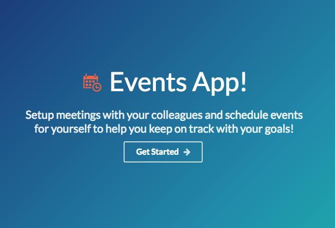
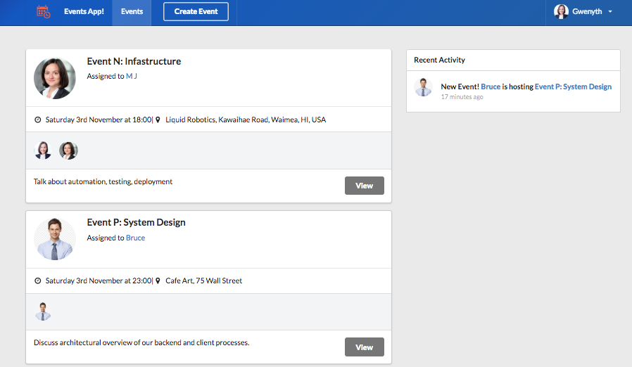
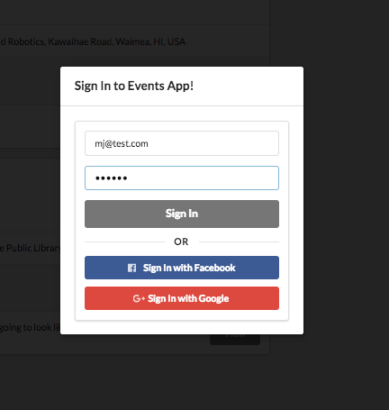
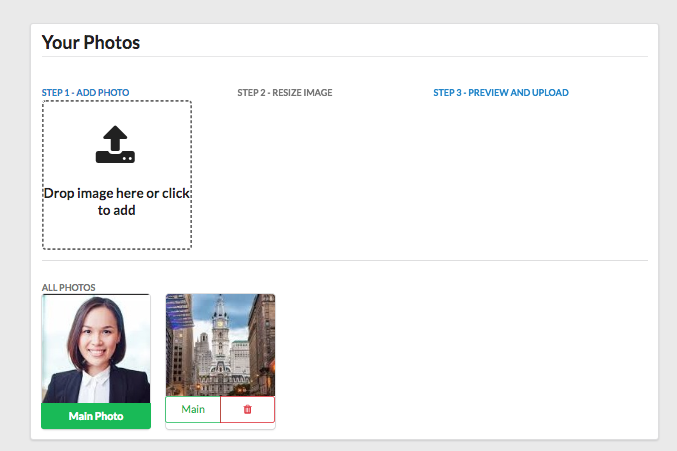
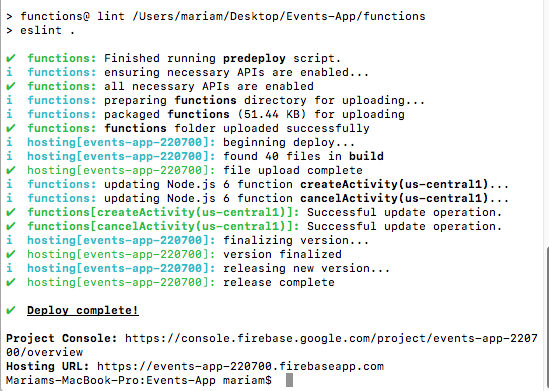
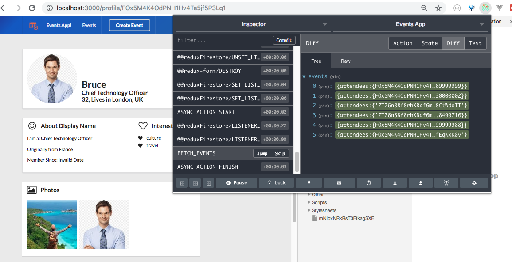
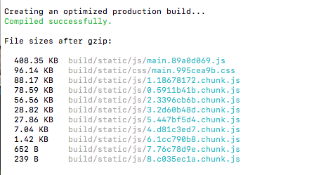

# React, Redux, Firebase & Firestore => Events App!

Please check out [my demo](https://events-app-220700.firebaseapp.com) to study the app's basic functionality. This app is an example of using Google Maps, Firebase, Firestore, Cloud Functions, Authentication, React, Redux Thunk and Semantic-UI React to build a web based application to schedule events, and meetings with your business partners to help keep moving your business ideas and projects forward! 

