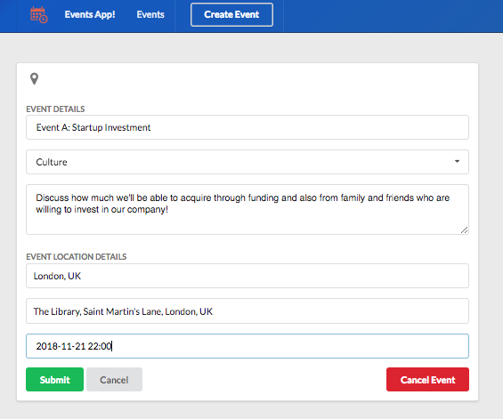
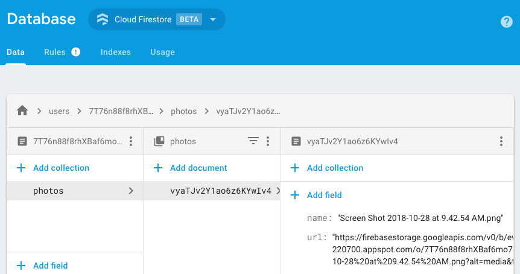
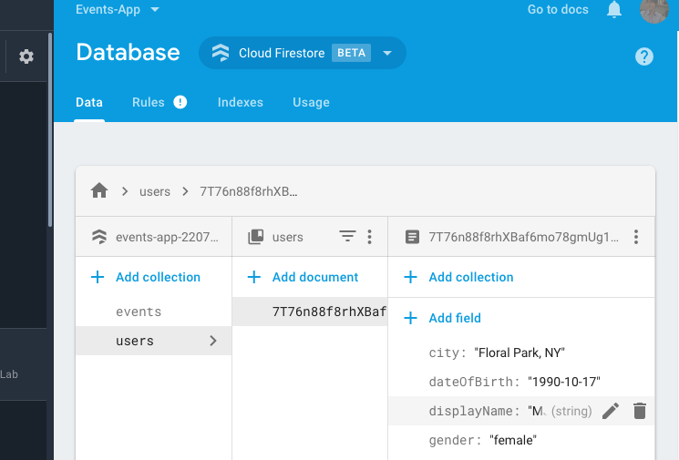

# React, Redux, Firebase & Firestore => Events App!

*This is the home page!*

Please check out [my demo](https://events-app-220700.firebaseapp.com) to study the app's basic functionality. This app is an example of using Google Maps, Firebase, Firestore, Cloud Functions, Authentication, React, Redux Thunk and Semantic-UI React to build a web based application to schedule events, and meetings with your business partners to help keep moving your business ideas and projects forward! A huge thank you to [Neil Cummings](https://www.udemy.com/user/neil-cummings-2/) for providing the tutorial on difficult aspects of getting Redux Thunk setup with Firestore Beta! 

*The email and Google/Facebook login - please note Facebook login isn't setup yet!*

*Your event form to create, and cancel events!*

*The events page with infinite scroll and a activity feed showing live events*

*The Event Page which shows `event_attendees`, event info, and the great chat! This chat features uses real-time database Firebase!*

*Google Maps in action! Toggle hide/show map! Please note I have a 1 per day limit quota for my API so you may not see full map*

*The image upload page in the ->profile/settings/images section this utilizes Firestore*

*This is an example of how the image upload from the UI would be stored in Firestore. Firestore uses collections and documents are added to that collection with fields that are certain values. This was a great learning experience on image uploads!* 

*Installed Firebase CLI and great green/blue notes to tell you all is well!*

*Taking advantage of monitoring Redux Chrome Extension to show event actions*

*Firestore collection and document schema for `users`, `events` and we added `activities` and `event_attendees` as well. Understanding what your collections are is a great practice for naming conventions as well.*

*Firebase Cloud Functions! This was my first experience with a almost serverless backend. Essentially you are running "functions" stored in `Cloud Functions` that get triggered by Firebase code you implement and HTTPS requests. Fascinating!! In this case there was a createActivity function and cancelActivity function to handle when users were "creating" and "canceling" events! 

*The wonderful and great "QuerySnap!" to the rescue! Lots of "snaps" in Firebase and Firestore (and we give them props and snaps as well for being super fast!) which essentially equate to "snapshots" but, this was used in code time and again to help keep "ref" to certain variables created and getting the right schema setup for your document.*

*This is where I learned about code splitting! This code was too big prior for deployment even with gzip*

*This is where I learned about `npm analyze` -- what an amazing feature -- this showed percentage of packages and dependencies used in your project. I also learned here that some packages can be removed or replaced and some cannot.*

